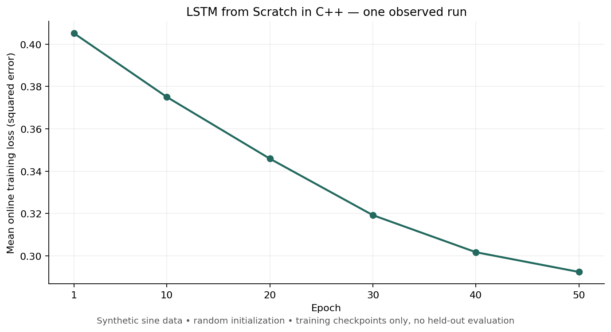
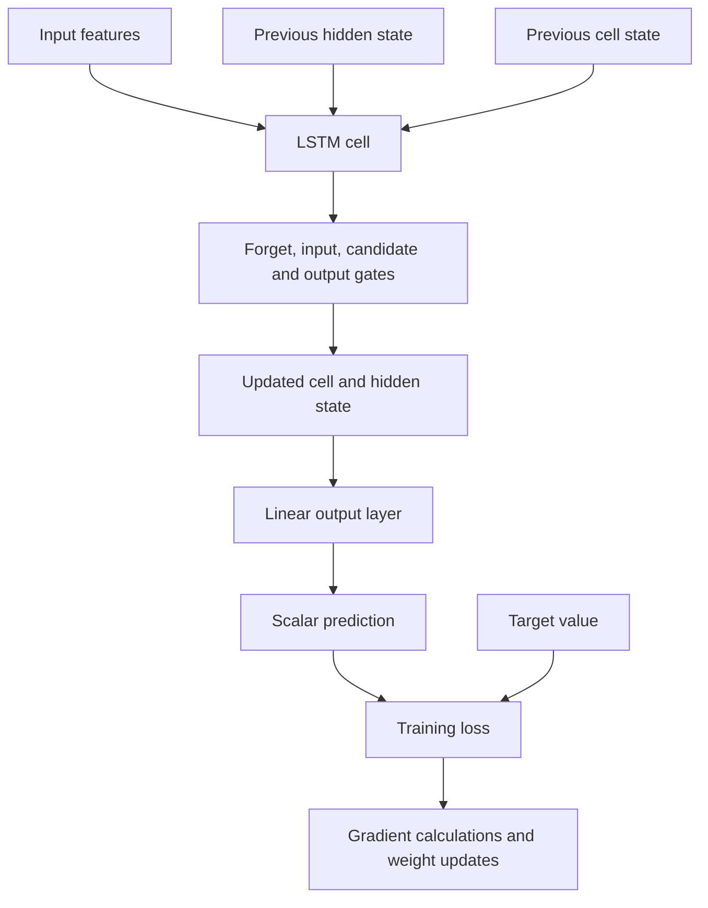

# LSTM from Scratch in C++

A single-file educational implementation of an LSTM cell and a small prediction network, using the C++ standard library.

This project makes the mechanics of recurrent networks inspectable: gate activations, cell and hidden state, a linear output layer, gradient calculations, and weight updates live in one source file. The included example trains on generated sine-wave samples.

**Scope:** a learning implementation, not a CUDA library or a validated forecasting package. It has no Python bindings or external ML framework dependency.

[Build and run](#build-and-run) · [Architecture](#architecture) · [Reading the code](#reading-the-code)

## Build and run

Requires a C++11-compatible compiler. No other libraries or datasets are needed.

```bash
git clone https://github.com/anudeepadi/lstm-from-scratch-cpp.git
cd lstm-from-scratch-cpp
c++ -std=c++11 -O2 lstm.cpp -o lstm-demo
./lstm-demo
```

The example trains for 50 epochs and prints loss checkpoints followed by input, target, and prediction values. Its weights are randomly initialized, so exact results vary.

The command was compiled and run with Apple Clang 21 on 22 September 2026. Completing the example is an execution check, not evidence of prediction accuracy or gradient correctness.

## An observed run



The figure comes from the [complete captured output](docs/training-run.txt), including all ten printed predictions. It shows the mean online training loss (each sample is scored before its update), not a held-out evaluation or the final model's loss on a fixed set.

```text
Epoch 1/50, Loss: 0.405091
Epoch 50/50, Loss: 0.292434
Input: 0, Actual: 0, Predicted: 0.832307
```

The decreasing loss does **not** mean the example fits the sine wave well: its prediction at zero is visibly inaccurate. This is useful code to read and investigate, with algorithm validation still outstanding.

To capture your own run and regenerate the plot:

```bash
./lstm-demo > docs/training-run.txt
python3 -m pip install matplotlib==3.10.8
python3 docs/plot_learning_curve.py
```

The plotting step is optional; building and running the C++ example needs no Python. Random initialization means your values and curve will differ.

## Architecture



The cell defines recurrent-state operations. Both training and prediction reset hidden and cell state for every sample, so the demonstration fits individual `(x, sin(x))` pairs rather than learning across a sequence. It does not expose a stateful streaming inference API.

## Reading the code

All implementation is in [lstm.cpp](lstm.cpp).

| Component | Responsibility |
| --- | --- |
| `DataSample` | Input feature vector and scalar target |
| Math helpers | Activations, vector/matrix operations, and clipping |
| `LSTMCell` | Gate computation, cell-state update, and backward calculations |
| `LSTMNetwork` | Output projection, training loop, and scalar prediction |
| `main()` | Synthetic data, hyperparameters, training, and printed examples |

The demonstration uses an input size of 1, hidden size of 32, output size of 1, learning rate of 0.01, and 100 generated training samples. These values are editable in `main()`.

## Example API

```cpp
LSTMNetwork network(1, 32, 1, 0.01, 50);
std::vector<DataSample> samples = {
    {{0.0}, 0.0},
    {{0.1}, std::sin(0.1)}
};
network.train(samples);
double prediction = network.predict({0.2});
```

This snippet illustrates the existing interface; the two samples are not a meaningful training dataset.

## Limits and next steps

- No automated gradient checks, hold-out accuracy tests, or performance benchmarks are included.
- The demo prints predictions on inputs drawn from its training range; this is not a generalization evaluation.
- Serialization, batching, GPU acceleration, and a stateful inference interface are not implemented.
- Gradients are propagated using weights that have already been updated; no numerical gradient check currently establishes correctness. The cell's returned previous-state gradients are not used for backpropagation through a sequence.

Useful contributions include seeded runs, numerical gradient checks, and a clearly separated train/test example. Keep the implementation readable enough to study.

## License

[MIT](LICENSE).
